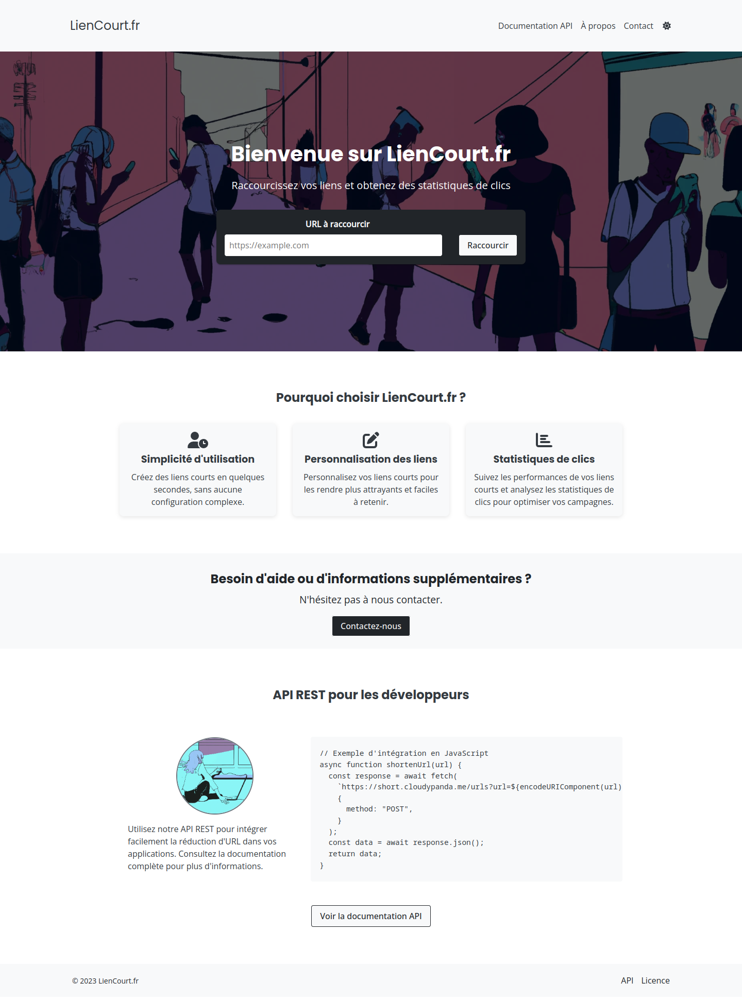

# lienb.fr Frontend

Ce dépôt contient le frontend de lienb.fr, une application web de raccourcissement d'URL amusante et réactive construite avec Vue.js. Elle s'intègre parfaitement avec l'[API lienb.fr](https://github.com/mathieuc22/url_shortener) pour vous offrir une expérience utilisateur fluide et agréable.

[](https://github.com/mathieuc22/url-shortener-frontend/blob/main/LICENSE)
[](https://app.netlify.com/sites/gleaming-pegasus-de71aa/deploys)

[](screenshot.png)

## Fonctionnalités

- Création de liens raccourcis
- Affichage des derniers liens raccourcis
- Copie des liens raccourcis dans le presse-papiers
- Génération de QR codes pour les liens raccourcis
- Interface utilisateur conviviale et réactive

## Installation et utilisation

1. Clonez ce dépôt :

```
git clone https://github.com/mathieuc22/url-shortener-frontend.git
```

2. Accédez au dossier du projet :

```
cd url-shortener-frontend
```

3. Installez les dépendances :

```
npm install
```

4. Lancez le serveur de développement :

```
npm run build
```

Les fichiers statiques seront générés dans le dossier `dist`. Côté serveur, il est nécessaire de définir une variable d'environnement `API_BASE_URL`.

## Contribuer

Les contributions sont les bienvenues ! N'hésitez pas à ouvrir des issues ou à proposer des pull requests pour améliorer l'application.

## Licence

Ce projet est sous licence MIT. Voir le fichier [LICENSE](https://github.com/mathieuc22/url-shortener-frontend/blob/main/LICENSE) pour plus de détails.
